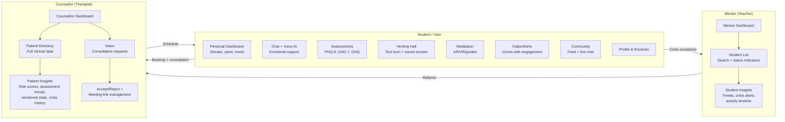
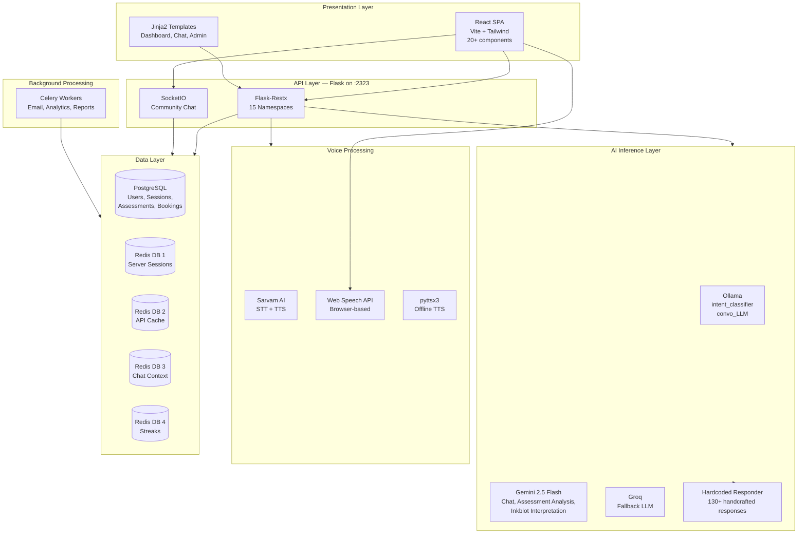
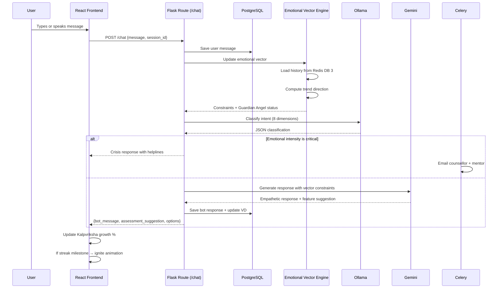
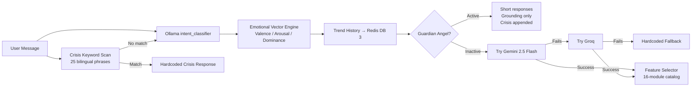
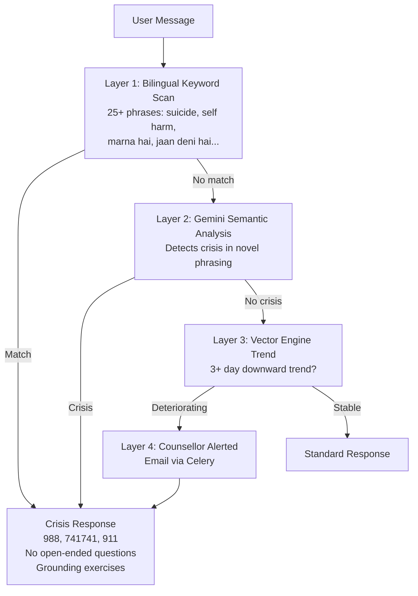

<p align="center">
  
  
  
  
  
  
</p>

<h1 align="center">Nivana — Proactive AI Mental Health Platform</h1>
<p align="center">
  An intent-aware, machine-driven mental health system that detects deterioration across sessions and intervenes before crisis.
</p>

---

## Table of Contents

- [Problem](#problem)
- [Solution](#solution)
- [Features](#features)
- [Architecture](#architecture)
- [Request Lifecycle](#request-lifecycle)
- [Repository Structure](#repository-structure)
- [Tech Stack](#tech-stack)
- [Setup](#setup)
- [Configuration](#configuration)
- [AI Pipeline](#ai-pipeline)
- [Crisis Detection](#crisis-detection)
- [API Reference](#api-reference)
- [Limitations](#limitations)
- [Roadmap](#roadmap)
- [Contributing](#contributing)

---

## Problem

Mental health applications share a fundamental design flaw: they are **user-initiated**. A person must recognise they are struggling, open the app, and seek help. By then, patterns of rumination, sleep disruption, and withdrawal have compounded over days or weeks. Research consistently shows help-seeking behaviour declines as symptom severity increases — the people who need support most are the *least* likely to open an app.

---

## Solution

Nivana inverts this model. It is **machine-driven**, not user-driven. The system continuously classifies every interaction across 8 emotional and cognitive dimensions, maintains a persistent emotional vector across sessions, runs trend analysis to detect deterioration *before* the user articulates it, and proactively surfaces interventions — a breathing exercise, an assessment, a counsellor booking — based on detected need.

```
User says "I'm fine"  →  VD engine detects low valence + high cognitive load
                        →  Guardian Angel protocol activates
                        →  Counsellor is notified
                        →  System suggests grounding exercise
```

---

## Features

### Intent-Aware AI Engine

Every user message is classified on 8 orthogonal axes. The classification runs locally via Ollama — zero API cost — and is passed as context to the conversational model.

| Dimension | Values | Purpose |
|-----------|--------|---------|
| `emotional_state` | calm, neutral, low, sad, anxious, stressed, overwhelmed, frustrated, angry, numb | Valence and emotional label |
| `intent_type` | venting, reassurance, advice, grounding, reflection, action_planning, informational, casual_chat | Route to correct response module |
| `cognitive_load` | low, medium, high | Control response complexity |
| `emotional_intensity` | mild, moderate, high, critical | Calibrate urgency |
| `help_receptivity` | resistant, passive, open, seeking | Prevent unsolicited advice |
| `time_focus` | past, present, future, mixed | Frame response temporally |
| `context_dependency` | standalone, session_dependent | Decide whether to reference history |
| `self_harm_crisis` | true, false | Trigger escalation protocols |

### Emotional Vector Engine (VD)

The "machine-centric" brain. Instead of discarding emotional context after each reply, Nivana maintains a persistent vector state:

- Tracks **valence**, **arousal**, and **dominance** over time
- Stores a history stack per chat session (last N interactions in Redis DB 3)
- Computes **trend direction** — improving, stable, or deteriorating — at every interaction
- Activates **Guardian Angel Protocol** when safety thresholds are crossed, which caps response length at 2 sentences, avoids open-ended questions, prioritises grounding exercises, and appends crisis resources to every response
- Injects emotional constraints into the Gemini prompt so the AI adapts its tone and content to the user's current state

### Clinical Assessments

Three standardised instruments with AI-enhanced result interpretation:

| Instrument | Construct | Range | Severity Levels |
|------------|-----------|-------|-----------------|
| PHQ-9 | Depression | 0–27 | Minimal, Mild, Moderate, Moderately Severe, Severe |
| GAD-7 | Anxiety | 0–21 | Minimal, Mild, Moderate, Severe |
| GHQ | General health | 0–48 | Good, Fair, Poor, Very Poor |

Results are analysed by Gemini for nuanced interpretation beyond raw scoring — distinguishing an acute episode from a chronic baseline. Score trends are tracked over time and surfaced on the counsellor dashboard.

### Voice — Three-Layer Architecture

| Layer | Technology | Languages | Dependency |
|-------|-----------|-----------|------------|
| Primary | Sarvam AI STT + TTS | Hindi, English, Hinglish | API key |
| Browser | Web Speech API (SpeechRecognition + SpeechSynthesis) | Hindi, English | Modern browser |
| Fallback | pyttsx3 (offline TTS) | English | pyttsx3 library |

The voice mode is **continuous hands-free** — once activated, the system alternates between listening and speaking. Silence detection (8–10s timeout) ends listening automatically. The system auto-detects Hindi vs English using Devanagari Unicode range detection and Hinglish keyword matching.

### Sound Venting Hall

A cathartic release room with two modes:

**Text Burning**: Users type their thoughts into a lined notebook-style textarea, then click "INCINERATE". A 3.8-second animation sequence plays: the paper chars from the centre outward via CSS mask animation, fire particles spawn (15 flame elements with `flame-dance` keyframes), ash particles rise (80 particles with varying colours and glow box-shadows), realistic fire crackling audio generated via Web Audio API noise. The text blurs and fades. Confirmation: *"It has been turned to ash."*

**Sound Screaming**: Real-time audio capture from the browser microphone with:
- A frequency analyser canvas visualisation (bars colour-coded green/blue for calm, red/black flicker for screaming)
- Scream detection at 35dB threshold with 2-second debounce, 300ms silence reset, haptic feedback via `navigator.vibrate(200)`
- Live stats: current dB, duration, scream count
- Session report saved to backend: `POST /api/venting/sound_session` with duration, max dB, average dB, scream count
- Screen shake animation (`scream-shake` keyframe), red overlay flash (`mix-blend-overlay`), vibrating border

### Kalpvriksha — Procedural Plant That Grows With Engagement

A decorative SVG creeper vine that grows from all four corners of the screen as the user engages with the app. Named *Kalpvriksha* ("wish-fulfilling divine tree" in Hindu mythology). It is the **visual reward system** of the platform.

**Growth mechanics:**

```
localStorage.getItem('intent_history')  →  array of chat intents with confidence scores
                                         →  growth % = sum(confidence × 5), capped at 100%
                                         →  polled every 2s, interpolated via requestAnimationFrame
```

**Plant architecture (8 independent vines):**

| Corner | Vines | Components |
|--------|-------|------------|
| Top-left | Main branch + secondary | Stem, Leaf, Bud, CherryBlossom, CherryLeaf |
| Top-right | Main branch + side | Stem, Leaf, Bud, CherryBlossom, CherryLeaf |
| Bottom-left | Tall branch + floor runner | Stem, Leaf, Bud, CherryBlossom, CherryLeaf |
| Bottom-right | Tall branch + floor runner | Stem, Leaf, Bud, CherryBlossom, CherryLeaf |

Each vine path defines at what growth percentage leaves appear and at what percentage buds bloom into cherry blossoms. Stems animate via SVG `stroke-dashoffset` transitions (0.3s ease-out). Leaves and flowers fade in with staggered opacity transitions (0.6–0.8s). Cherry blossoms sway gently via `<animateTransform>` (7–8s cycles). Drop shadows via `feGaussianBlur`.

The plant renders as a `pointer-events-none` fixed layer behind the Dashboard, so it grows in the background while the user interacts with the app.

### Dashboard — Streak Glow Effects

The main dashboard (`Dashboard.jsx` on a `bg-[#0f131c]` background) prominently displays the **login streak** count with a fire animation:

```css
/* The streak number ignites */
@keyframes flame {
  0%, 100% { transform: scale(1); opacity: 0.8; }
  50%      { transform: scale(1.1) rotate(2deg); opacity: 1; }
}
```

- On mount, the streak count starts invisible (`opacity-0`, `blur-xl`, `translate-y-4`) and after 300ms transitions to full visibility over 1s — a "glowing ember catching fire" effect
- Skeleton loading uses `animate-pulse`
- Cards have `group-hover` scale transitions, colour shifts, arrow motion
- Thin custom scrollbar styling
- Data fetched from `GET /api/dashboard` (login_streak, meditation_streak, tasks, consultations)
- Kalpvriksha grows beneath as a decorative background layer

### AR Breathing

An **augmented reality breathwork** session using A-Frame + AR.js:

- Loads A-Frame and AR.js dynamically at runtime
- Creates an `<a-scene>` with `arjs="sourceType: webcam"` — uses the device camera
- A Hiro marker triggers an `<a-sphere>` that animates scale to guide breathing
- **Fallback mode**: If camera access is denied, a markerless 3D sphere floats in view

**Breathing patterns:**

| Pattern | Rhythm | Use Case |
|---------|--------|----------|
| Box | In 4s → Hold 4s → Out 4s → Hold 4s | General calm |
| Sleep | In 4s → Hold 7s → Out 8s | Bedtime |
| Calm | In 6s → Hold 2s → Out 6s → Hold 2s | Extended sessions |
| Emergency | In 3s → Out 3s (no hold) | Panic attacks — sends SOS alert to mentor |

Each session is saved via `POST /api/meditation/complete`. Emergency SOS sessions trigger an alert on the mentor dashboard.

### VR Meditation

A **360-degree VR meditation** experience with A-Frame:

- Three panoramic scenes: Peaceful Forest (lake/forest `sechelt.jpg`), Calm Beach (abstract `cubes.jpg`), High Mountain (city fallback)
- A white breathing sphere pulses at eye level (`scale: 1 → 1.5, dur: 4000ms, alternate, loop`)
- Ambient audio per scene (nature sounds, waves, piano)
- Reticle cursor for VR headset interaction
- The sky rotates slowly (200s cycle) for atmospheric immersion
- Semi-transparent overlay UI with `backdrop-blur-md`
- Timer-based session tracking

### Community — Peer Support Feed

Two tabs:

**Support Feed**: A social-wall where users post anonymously or with their name, add emotion tags (Support, Healing, Grateful), like posts (optimistic update, rose-500 fill), and reply. Ghost avatar for anonymous, initial-letter for identified. Empty state: "Silence is the first step..." with shield icon.

- `GET /api/venting/posts` — fetch feed
- `POST /api/venting/posts` — create post
- `POST /api/venting/posts/:id/like` — toggle like
- `POST /api/venting/responses` — reply

**Live Chat**: Real-time chat room via SocketIO with multiple channels (Anxiety Support, Depression Support, Mindfulness, General Wellness). Join/leave rooms, message history on connect, "me" messages right-aligned in indigo vs dark-bg left-aligned for others. Green pulsing connected dot. Secure Peer-to-Peer Subsystem footer.

### Counsellor & Mentor Flow

The platform has three user roles — **Student**, **Mentor** (teacher), and **Counsellor** — each with distinct views and permissions:



**Mentor Dashboard** (`MentorDashboard.jsx`):
- Stats row: Total Students, Doing Well, Needs Attention, Critical, At Risk
- Searchable student cards with avatar, status badge (green/amber/red), pulsating red dot for unacknowledged risk
- Student detail view: Engagement tier, consistency streak, crisis indicators (30d), current emotional state + intensity, crisis alert timeline (critical/high/moderate with acknowledgment), onboarding report PDF download, activity summary (meditation count, assessments, chat sessions, venting count), activity timeline, wellness trends area chart (Recharts)
- Data: `GET /api/mentor/students`, `GET /api/mentor/student/:id/insights`, `GET /api/mentor/student/:id/onboarding-report/pdf`

**Counsellor Dashboard** (`CounsellorDashboardNew.jsx`):
- Patient directory with search, risk level badges (critical/high/moderate/low)
- Patient detail: Login streak, assessments count, total activities, crisis alerts, current emotional state + intensity, emotional state distribution pie chart, activity breakdown bar chart, assessment score trends area chart, detailed assessment results with severity, crisis alerts log, shared documents (assessment/inkblot PDFs)
- Right sidebar inbox: Pending consultation requests (accept/reject with urgency badge), upcoming sessions with meeting link management (add/update Google Meet/Zoom link)
- Data: `GET /api/counsellor/patients`, `GET /api/counsellor/inbox`, `GET /api/counsellor/patient/:id/insights`, `POST /api/counsellor/inbox/:id/action`

### Inkblot Projective Test

A digital Rorschach test:
1. System presents an abstract inkblot image
2. User describes what they see
3. Gemini analyses the response for emotional projection markers
4. Results are logged for counsellor review with PDF export

### PerenAll AI

A separate plant-themed conversational companion. The plant's responses are conditioned on the user's emotional state — a low-barrier entry point for users who find direct conversation intimidating.

### Routines & Tasks

Daily mental health routine builder with timed tasks (start/end times), completion tracking, and weekly progress visualisation on the dashboard.

### Multi-Language

Full Hindi and English via Flask-Babel. The interface locale toggles at any point, and the AI responds in the language detected in the user's message.

---

## Architecture



### Design Decisions

**Flask + Restx over FastAPI**: The project started before FastAPI's async template ecosystem matured. Flask-Restx provides Swagger docs, request parsing, and namespace organisation alongside Jinja2 server-rendered pages.

**4 Redis DBs**: Isolation prevents one component's eviction policy from affecting another. Session TTLs are short (hours), cache is medium (minutes), context needs longer retention, streaks are permanent counters.

**Local intent classification, cloud conversation**: Classification is a constrained, low-dimensional task — perfect for a small local Ollama model. Conversation requires empathy and nuance — Gemini's domain. This split keeps API costs near-zero while maintaining response quality.

**Kalpvriksha is localStorage-only**: No backend calls for the plant. This means it works offline and doesn't add database load, but also means it resets if the user clears browser storage.

---

## Request Lifecycle



---

## Repository Structure

```
techfiesta_mentalhealth/
│
├── app.py                        # Flask application factory
│                                 # SQLAlchemy, Redis × 4, Babel, LoginManager,
│                                 # Cache, Migrate, Session, SocketIO, 15 API namespaces
│
├── main.py                       # Entry point — socketio.run on port 2323
│
├── routes.py                     # 2000+ lines — all server-rendered route handlers
│                                 # Chat, assessments, venting, voice, inkblot,
│                                 # nivana compassion flow, admin, counsellor
│
├── database.py                   # SQLAlchemy instance + 4 Redis clients
│
├── db_models.py                  # 15+ ORM models
│                                 # User, ChatSession, ChatMessage, Assessment,
│                                 # MeditationSession, VentingPost, VentingResponse,
│                                 # ConsultationRequest, AvailabilitySlot,
│                                 # RoutineTask, SoundVentingSession, Organization
│
├── gemini_service.py             # Gemini 2.5 Flash — chat, assessment analysis,
│                                 # inkblot analysis, bilingual crisis keywords
│
├── voice_service.py              # pyttsx3 offline TTS (threaded worker queue)
│
├── sarvam_voice_service.py       # Sarvam AI STT + TTS with Hinglish detection
│
│
├── models/
│   ├── Modelfile.intent_classifier    # Ollama model: 8-dim classification
│   ├── Modelfile.convo_LLM            # Ollama model: conversation + feature catalog
│   ├── engine.py                      # Full intent + convo pipeline (608 lines)
│   ├── api.py                         # FastAPI wrapper for Ollama models
│   └── json_sanitizer.py              # JSON extraction from unstructured LLM output
│
├── api/                           # 15 Flask-Restx namespaces
│   ├── auth_api.py                # Registration, login, profile
│   ├── chatbot_api.py             # Send message, get history
│   ├── assessments_api.py         # PHQ-9, GAD-7, GHQ
│   ├── dashboard_api.py           # User stats
│   ├── venting_api.py             # Text + sound venting
│   ├── consultation_api.py        # Counsellor booking
│   ├── meditation_api.py          # Session log, streaks
│   ├── voice_api.py               # STT / TTS
│   ├── resources_api.py           # Resource library
│   ├── inkblot_api.py             # Projective test
│   ├── perenall_api.py            # Plant companion
│   ├── analytics_api.py           # Aggregate trends
│   ├── activity_api.py            # Engagement log
│   ├── mentor_api.py              # Mentor cohort monitoring
│   ├── counsellor_api.py          # Counsellor case management
│   ├── routine_api.py             # Daily routine CRUD
│   └── chat_socket.py             # SocketIO chat events
│
├── utils/
│   ├── common.py                  # PHQ-9/GAD-7/GHQ scoring, fallback responses (718 lines)
│   ├── email_service.py           # SMTP with role-based addressing
│   ├── celery_app.py              # Celery configuration
│   ├── supabase_client.py         # Optional Supabase
│   └── upload_service.py          # File uploads
│
├── src/                           # React 19 + Vite + Tailwind
│   └── src/
│       ├── App.jsx                # 20+ routes
│       ├── config.js              # Dynamic API URL (hostname:2323)
│       ├── index.css              # Flame keyframes, custom scrollbar
│       └── components/
│           ├── Chat.jsx / ChatHistory.jsx    # AI chat with SocketIO
│           ├── Dashboard.jsx / DashboardFinal.jsx  # Streak glow + plant layer
│           ├── LandingPage.jsx
│           ├── Onboarding.jsx                 # Multi-step signup
│           ├── Meditation.jsx / MeditationHub.jsx
│           ├── PrivateVentingRoom.jsx         # Text burn + sound scream
│           ├── Assessments.jsx
│           ├── Inkblot.jsx
│           ├── Kalpvriksha.jsx               # Plant orchestrator
│           ├── CreeperPlant.jsx              # 8 vine path definitions
│           ├── Stem.jsx / Leaf.jsx / Flower.jsx / Bud.jsx  # SVG plant parts
│           ├── CherryBlossom.jsx / CherryLeaf.jsx           # Bloom components
│           ├── GrowthControls.jsx            # Debug panel (weight control)
│           ├── Consultant.jsx
│           ├── MentorDashboard.jsx
│           ├── CounsellorDashboardNew.jsx
│           ├── Community.jsx / CommunityChat.jsx  # Feed + SocketIO chat
│           ├── Resources.jsx
│           ├── Profile.jsx
│           ├── TasksManager.jsx
│           ├── VrMeditation.jsx              # 360-degree A-Frame
│           ├── MagicBento.jsx                # Particle + spotlight showcase
│           ├── GlobalCrisisButton.jsx
│           ├── NotificationBell.jsx
│           └── Features/
│               └── Ar_breathing.jsx          # A-Frame + AR.js camera breathwork
│
├── translations/                  # Babel i18n (en, hi)
├── migrations/                    # Alembic migrations
├── old_tries/                     # Historical prototypes — safe to remove
│
├── ARCHITECTURE.md
├── AR_VR_Integration_Plan.md      # Future AR/VR spec (138 lines)
├── VOICE_CONVERSATION_README.md   # Voice mode user guide (144 lines)
├── PROJECT_PROMPT.md              # Original requirements
│
├── requirements.txt
├── run_app.sh / run_app.ps1
└── run_celery.ps1
```

---

## Tech Stack

| Category | Technology | Rationale |
|----------|-----------|-----------|
| Backend | Flask 3.x + Flask-Restx | Server-rendered pages + REST APIs in one process |
| Real-time | Flask-SocketIO | WebSocket community chat with room management |
| Database | PostgreSQL (SQLAlchemy ORM) | Relational integrity for users, assessments, bookings |
| Cache | Redis (4 logical DBs) | Session store, API cache, chat context, streaks |
| Background | Celery + Redis broker | Email, AI batch analysis, CSV reports |
| Primary AI | Gemini 2.5 Flash | Conversation, assessment interpretation, inkblot |
| Local AI | Ollama (2 custom models) | Intent classification + conversation — zero cost |
| Fallback AI | Groq (Llama 3) | Redundant LLM path |
| Voice STT/TTS | Sarvam AI API | Hindi/English/Hinglish with context detection |
| Browser Voice | Web Speech API | Zero-dependency continuous voice mode |
| Offline TTS | pyttsx3 | Fallback when cloud unavailable |
| Frontend | React 19 + Vite + Tailwind 3 | Fast builds, utility-first CSS |
| Animation | GSAP | Procedural plant growth, page transitions |
| AR | A-Frame + AR.js | Camera-based breathing exercises |
| VR | A-Frame | 360-degree meditation scenes |
| Charts | Recharts | Score trend visualisation |
| i18n | Flask-Babel | Hindi + English UI |
| PDF | ReportLab | Assessment report export |

---

## Setup

### Prerequisites

- Python 3.10+, Node.js 18+, PostgreSQL 14+ (or SQLite), Redis 7+, Ollama
- Gemini API key (required), Sarvam AI key (optional for voice), Groq key (optional)

### Installation

```bash
# 1. Create Ollama models
cd models
ollama create intent_classifier -f Modelfile.intent_classifier
ollama create convo_LLM -f Modelfile.convo_LLM
ollama list
cd ..

# 2. Python environment
python -m venv venv && source venv/bin/activate
pip install -r requirements.txt
cp .env.example .env  # Edit GEMINI_API_KEY

# 3. Database
python -c "from app import app, db; app.app_context().push(); db.create_all()"

# 4. Frontend
cd src && npm install && cd ..
```

### Running (4 terminals)

```bash
# Terminal 1 — Redis
redis-server

# Terminal 2 — Celery (--pool=solo on Windows)
celery -A utils.common.celery worker --pool=solo --loglevel=info

# Terminal 3 — Flask
python main.py
# → http://localhost:2323  (API + Swagger /docs)
# → http://localhost:2323/ (Jinja2 pages)

# Terminal 4 — React frontend
cd src && npm run dev
# → http://localhost:5173  (SPA)
```

---

## Configuration

| Variable | Required | Default | Description |
|----------|----------|---------|-------------|
| `GEMINI_API_KEY` | Yes | — | Primary AI |
| `GROQ_API_KEY` | No | — | AI fallback |
| `SARVAM_API_KEY` | No | — | Voice STT/TTS |
| `DATABASE_URL` | No | `sqlite:///mental_health.db` | PostgreSQL URI |
| `REDIS_URL` | No | `redis://127.0.0.1:6379` | Redis |
| `SMTP_HOST` | No | — | Email server |
| `SECRET_KEY` | No | Dev fallback | Session signing |
| `OLLAMA_HOST` | No | `http://localhost:11434` | Ollama server |

---

## AI Pipeline



### Models

**intent_classifier** (base: `llama3.2`): Fine-tuned via Ollama Modelfile with ~600 lines of system prompt defining the 8-dimension taxonomy + correct/incorrect classification examples.

**convo_LLM** (base: `llama3.2`): Prompted with user message + intent JSON + feature catalog (16 therapeutic modules — breathing, body scan, nature sounds, AR breathing, venting hall, assessments, etc.). Returns JSON containing empathetic reply + suggested feature.

---

## Crisis Detection

Four layers, evaluated in order:



Guardian Angel Protocol (activated by VD engine):
- Response length capped at 2 sentences
- No open-ended questions
- Grounding exercises prioritised
- Crisis resources appended to every response
- Counsellor + mentor notified via email

---

## API Reference

Full Swagger: `http://localhost:2323/docs`

**REST endpoints** — 15 namespaces under `/api`:

| Namespace | Key Endpoints |
|-----------|---------------|
| `/auth` | Login, register, profile, logout |
| `/dashboard` | Stats, streaks |
| `/chatbot` | Send message, history |
| `/assessments` | PHQ-9, GAD-7, GHQ submit + results |
| `/venting` | Create post, respond, sound session |
| `/consultation` | Slots, book, upcoming |
| `/meditation` | Log session, streaks |
| `/voice` | Transcribe, TTS, chat |
| `/inkblot` | Submit, results |
| `/perenall` | Interact, state |
| `/analytics` | Trends, cohort summary |
| `/mentor` | Students, student insights, onboarding PDF |
| `/counsellor` | Cases, inbox, availability, patient insights |
| `/routine` | Tasks CRUD |
| `/resources` | Categories, items |

**WebSocket** (SocketIO, `/socket.io`):

| Event | Direction | Payload |
|-------|-----------|---------|
| `chat_join` | Client → Server | `{ session_id }` |
| `chat_message` | Client → Server | `{ session_id, message }` |
| `chat_response` | Server → Client | `{ message, crisis_detected, assessment_suggestion }` |
| `join` | Client → Server | `{ room: "anxiety" }` (community chat) |
| `leave` | Client → Server | `{ room }` |
| `message` | Bidirectional | `{ username, content, room }` |
| `history` | Server → Client | `[{ username, content, timestamp }]` |

---

## Screenshots

<!--
TODO: Add these screenshots to /assets/screenshots/:

1. Dashboard with Kalpvriksha plant growing in background + streak counter with fire animation
2. Chat interface with intent classification JSON visible
3. Private Venting Room — text burning animation sequence (before/during/after)
4. AR Breathing — camera view with 3D breathing sphere
5. VR Meditation — 360-degree forest panorama
6. Community — support feed with emotion tags
7. Counsellor Dashboard — patient directory + inbox sidebar
8. Mentor Dashboard — student list with risk indicators
9. Inkblot test interface
10. Onboarding flow
-->

---

## Limitations

- **Ollama models must be created before first run** — one-time step, easy to miss
- **Sarvam AI voice requires an API key** — without it, voice falls back to pyttsx3 (robotic) or Web Speech (browser-dependent)
- **Emotional Vector (VD) state is ephemeral** — stored in Redis + ChatSession model, not in permanent embeddings. DB reset loses trend history
- **No native mobile client** — web-only. AR/VR features (specified in `AR_VR_Integration_Plan.md`) are not yet production-ready
- **Content safety filters not tuned** — Gemini is used without safety filter configuration for mental health domain
- **Translations incomplete** — some Jinja2 strings remain hardcoded in English
- **Single-server architecture** — Flask + SocketIO run in one process. Not horizontally scalable without WSGI middleware
- **Kalpvriksha resets on localStorage clear** — no backend persistence for plant state

---

## Roadmap

- [ ] Persistent emotional embeddings in vector DB (FAISS/Pinecone)
- [ ] WhatsApp integration via Twilio
- [ ] AR breathing with ML posture detection (MediaPipe)
- [ ] VR meditation environments (specs documented — implement)
- [ ] Automated weekly PDF reports for counsellors
- [ ] Peer support moderation tools
- [ ] React Native mobile app with local LLM (MLX / NNAPI)
- [ ] Configure Gemini safety settings for mental health
- [ ] Multi-tenant organisation support (schools, colleges)
- [ ] End-to-end encryption for chat + assessment data at rest

---

## Contributing

Built for TechFiesta 2026.

### Architecture Principles

1. **Intent and conversation are separate models** — modifying one should not require changing the other
2. **Every AI path has a fallback** — Gemini → Groq → hardcoded. The chat route must never 500
3. **Emotional state is never discarded** — every message updates the VD
4. **Crisis checks run before AI** — keyword scan executes before any model inference

### Cleanup

```bash
rm -rf old_tries/
rm debug_upload.py test_up.py reset_db.py seed_crm.py seed_insights.py
rm setup_supabase.py verify_supabase.py migrate_consultation.py migrate_profile.py
rm update_onboarding_status.py update_severity_column.py
```

---

## License

MIT
